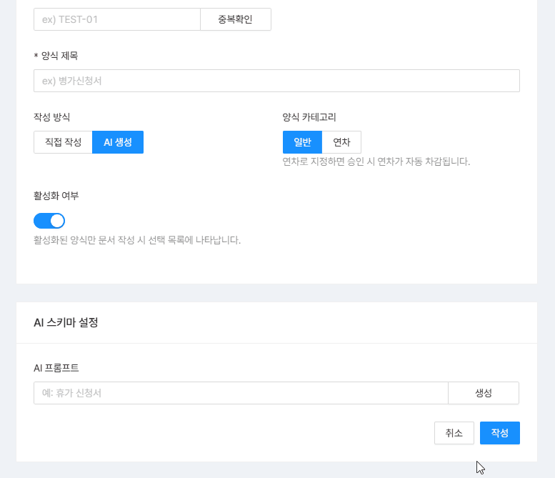
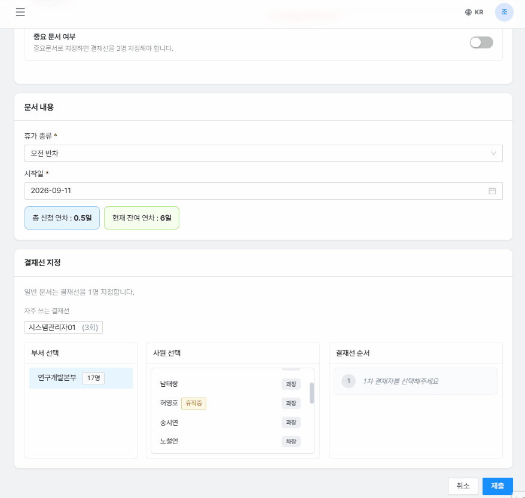
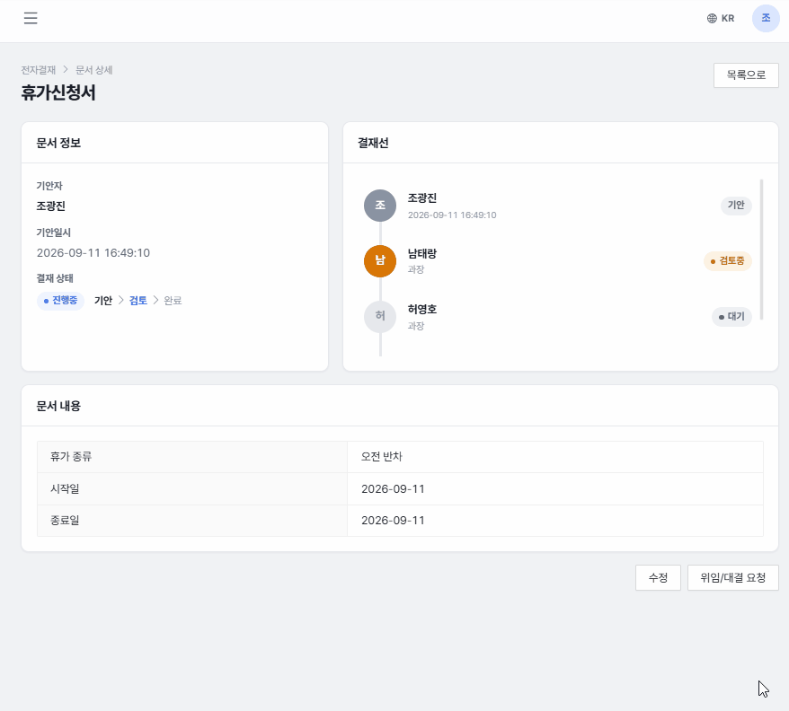
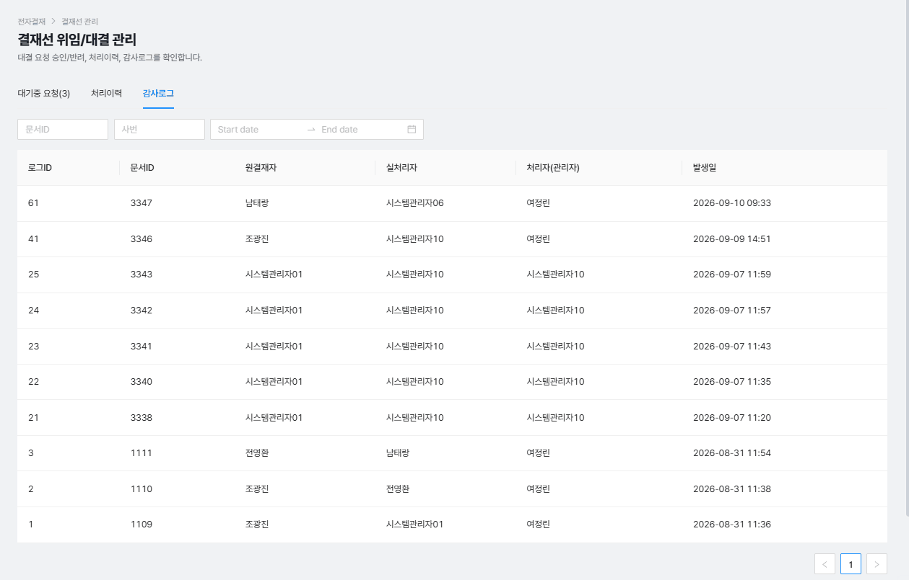
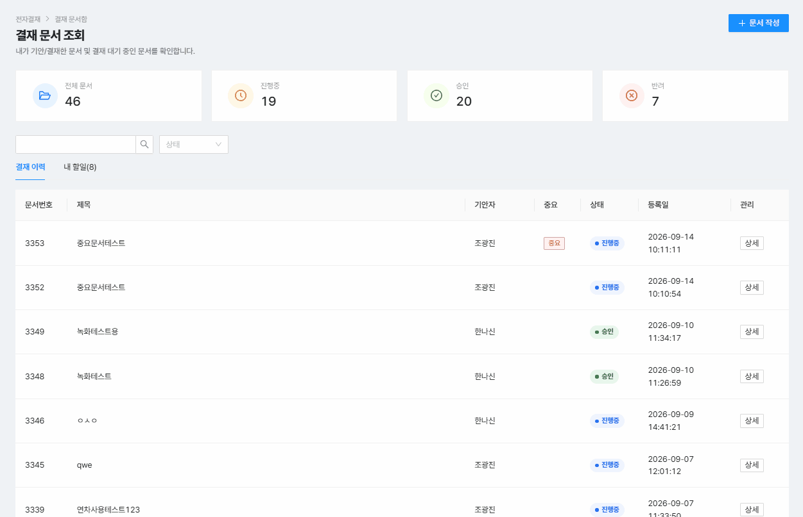
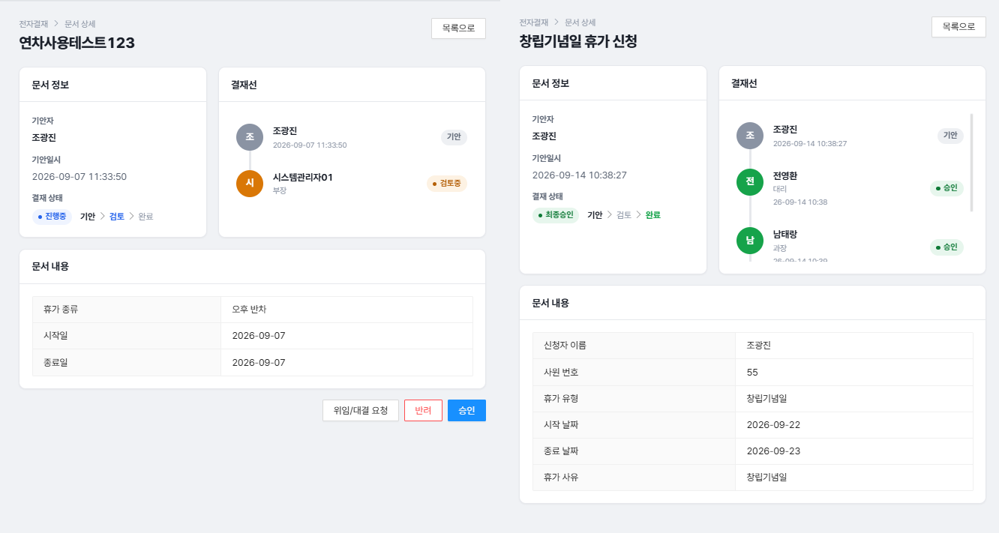

# SBerp v3 · 전자결재(Electronic Approval) 모듈

### 🔗 [Live Demo: sberpjy.duckdns.org](http://sberpjy.duckdns.org)

> 4인 팀 ERP 프로젝트 중 **전자결재 모듈을 단독 설계·개발**한 개인 저장소입니다.
> 원본 팀 프로젝트: Spring MVC(v1) → Spring Boot + Thymeleaf(v2) → **Spring Boot 3 + Next.js(v3, 현재 버전)**

> 📌 **본 저장소는 팀 프로젝트(SBerp) 중 본인이 단독으로 설계·개발한 전자결재 모듈 코드만 별도로 재구성한 개인 포트폴리오 저장소입니다.** (v1/v2는 팀 코드 전체를 아카이빙한 저장소이며, v3는 본인 파트만 담고 있습니다.)
> 팀 전체 원본 저장소: https://github.com/yoonguri988/spring-breeze-erp

<p align="left">
  
  
  
  
  
  
  
</p>

<br>

## 목차
- [프로젝트 개요](#-프로젝트-개요)
- [기술 스택](#-기술-스택)
- [담당 역할](#-담당-역할)
- [ERD](#-erd-entity-relationship-diagram)
- [아키텍처](#️-아키텍처)
- [핵심 기능](#-핵심-기능)
- [스크린샷](#-스크린샷)
- [트러블슈팅](#-트러블슈팅)
- [배포 / CI-CD](#-배포--ci-cd)
- [라이선스](#-라이선스)
- [관련 저장소](#-관련-저장소)

<br>

## 📌 프로젝트 개요

| 항목 | 내용 |
|---|---|
| 프로젝트명 | SBerp v3 (spring-breeze-erp-v3) |
| 팀명 | Spring Breeze |
| 팀 인원 | 4명 |
| 도메인 | Enterprise Resource Planning — 전자결재 모듈 |
| 개발 상태 | 배포 진행 중 (SSL 적용 예정) |
| 대상 사용자 | 중소 규모 기업 관리자 / 임직원 |
| 본인 담당 | 전자결재(ApprForm · ApprDoc · ApprLine) 단독 설계·개발 |

SBerp는 4인 팀이 개발한 사내 ERP 시스템으로, 전자결재·근태·조직관리·프로젝트관리 모듈로 구성되어 있습니다. 이 저장소는 그중 제가 **단독으로 설계하고 개발한 전자결재 모듈**만을 담고 있습니다.

v1(Spring MVC + MyBatis)에서 시작해 v2(Spring Boot + Thymeleaf)를 거쳐, v3에서는 **Spring Boot 3 + Next.js 기반 REST API 아키텍처**로 전면 재설계했습니다. 이 과정에서 이전 버전의 코드를 스스로 감사(self-audit)하여 보안 취약점을 찾고 개선한 경험이 이 프로젝트의 핵심 스토리입니다.

<br>

## 🛠 기술 스택

| 구분 | 기술 |
|---|---|
| Backend |      |
| Data Access |   |
| Database |  |
| Frontend |     |
| AI 연동 |  |
| Infra |     |
| CI/CD |  |

<br>

## 👥 담당 역할

팀 내에서 아래 3개 도메인을 단독으로 설계·개발했습니다.

| 도메인 | 설명 |
|---|---|
| `ApprForm` | 결재 양식 관리 — 버전 관리, OpenAI API 기반 AI 양식 자동 생성 |
| `ApprDoc` | 결재 문서(기안) 관리 — 결재 워크플로우 엔진 |
| `ApprLine` | 결재선 구성 — 결재 순서, 위임/대결 처리 |

*(근태/HR은 정수정, 조직관리는 최윤정, 프로젝트관리는 최다영 팀원 담당 — 해당 모듈은 이 저장소에 포함되지 않습니다.)*

<br>

## 🗂 ERD (Entity Relationship Diagram)

본인이 담당한 전자결재 도메인의 핵심 테이블입니다.

- **APPROVAL**: `appr_form`(결재 양식), `appr_doc`(결재 문서), `appr_line`(결재선)
- `appr_form`은 버전 필드(`for_version`)와 소프트 삭제(`is_deleted`)로, 문서가 제출된 시점의 양식을 그대로 보존합니다.
- `appr_doc`은 `com_id`(회사)를 기준으로 격리되며, 다른 회사의 문서에 접근할 수 없도록 서버에서 강제합니다.
- `appr_line`은 `appr_doc`과 1:N 관계로, 결재 순서를 기준으로 순차 처리됩니다.

<br>

## 🏗️ 아키텍처

```
[Next.js Frontend] ──REST API(JWT)──▶ [Spring Boot 3 Backend] ──▶ [Oracle 23ai]
        │                                     │
        └── Redux-Saga (비동기 흐름)            └── Redis (세션/캐시)
```

- 인증: JWT 기반, `@AuthenticationPrincipal`로 서버에서 회사(comId)를 도출 — 클라이언트 입력값을 신뢰하지 않음
- 인가: 컨트롤러 → 서비스 → 매퍼 전 계층에서 comId 검증 (Defense in Depth)
- 결재 문서 관련 API는 모두 `/api/appr/**` 하위로 통일해 Spring Security `.authenticated()` 규칙 적용

<br>

## 🚀 핵심 기능

- **결재 양식(ApprForm)**: 버전 관리, OpenAI API로 자연어 설명을 입력하면 구조화된 JSON 양식 자동 생성 (`response_format: json_object` + 프론트엔드 필드 검증)
- **결재 문서(ApprDoc)**: 기안 → 결재선 순차 처리 → 승인/반려 워크플로우
- **결재선(ApprLine)**: 결재선 구성, 개별 위임(대결) 요청, 즐겨찾기 결재선
- **결재 이력**: 타임라인 형태로 문서별 처리 이력 조회

<br>

## 📸 스크린샷

**1. AI 결재 양식 자동 생성**

<p align="center"></p>

관리자가 "휴가 신청서"처럼 자연어로 원하는 양식을 입력하면, OpenAI API가 구조화된 JSON을 반환해 양식 필드가 자동으로 채워집니다. 직접 작성/AI 생성 모드를 토글로 전환할 수 있습니다.

<br>

**2. 결재선 구성**

<p align="center"></p>

부서 → 사원 → 결재 순서 지정까지 3단 패널로 이어지는 흐름입니다. 자주 쓰는 결재선을 즐겨찾기로 저장해 재사용할 수 있습니다.

<br>

**3. 위임(대결) 요청**

<p align="center"></p>

결재 상세 화면에서 "위임/대결 요청" 버튼을 눌러 본인의 결재 권한을 다른 사원에게 위임하는 흐름입니다.

<br>

**4. 위임(대결) 요청 처리**

<p align="center"></p>

위임을 요청받은 사원이 요청을 확인하고 승인/반려하는 화면입니다.

<br>

**5. 결재 문서함**

<p align="center"></p>

본인이 기안했거나 결재해야 할 문서를 상태별(진행중/완료/반려)로 조회하는 목록 화면입니다.

<br>

**6. 결재 상세 / 타임라인**

<p align="center"></p>

문서 상세 정보와 함께, 결재선을 따라 각 결재자의 처리 상태(기안/검토중/대기/완료)를 타임라인 형태로 보여줍니다.

<!-- 선택 추가 후보: (7) 결재 반려 처리 — 반려 사유 입력 화면, (8) 양식 버전 관리 — 수정 시 새 버전 생성되는 화면 -->

<br>

## 🐛 트러블슈팅

프로젝트 진행 중 겪은 문제와 설계 결정 과정입니다.

**1. IDOR(권한 우회) 취약점 자체 발굴 및 방어**
v2 → v3 전환 과정에서 기존 코드를 감사하던 중, 클라이언트가 보낸 ID 값을 그대로 신뢰해 다른 회사의 결재 데이터에 접근 가능한 지점을 다수 발견했습니다. 이를 계기로 모든 데이터 조회를 `@AuthenticationPrincipal`에서 서버가 직접 도출한 comId로 제한하고, Controller-Service-Mapper 전 계층에 동일한 검증을 중복 배치했습니다.

**2. 결재선 정합성 버그**
결재가 순서대로 처리되지 않고 다음 결재자가 활성화되지 않는 현상을 로그로 추적한 결과, 하나의 매퍼 메서드(`updateLineStatus`)가 "현재 결재선 처리"와 "다음 결재선 활성화"를 동시에 담당하면서 조건이 뒤섞여 있었습니다. `activateNextLine`을 별도 메서드로 분리해 해결했습니다.

**3. 위임/대결 기능의 IDOR 재발 방지**
초기 IDOR 방어 이후 추가한 결재선 위임(대결) 기능에서도 동일한 패턴의 취약점이 재발할 뻔했습니다. 신규 기능을 개발할 때마다 이전에 정리한 "comId 검증 체크리스트"를 기준으로 자체 리뷰하는 습관을 들였고, 제출 전 위임 요청 API에서 비슷한 누락을 미리 발견해 수정했습니다.

**4. Lombok boolean 필드 getter 트랩**
`boolean isImportant` 필드에 Lombok을 적용하면 getter가 `isImportant()`로 생성되는데, MyBatis resultMap의 `property`나 프론트 폼 `name`을 `isImportant`로 그대로 쓰면 매핑이 조용히 실패합니다. `property="important"` / `name="important"`로 통일해 해결했습니다.

**5. STS 컴파일러 옵션 이슈**
STS(Spring Tool Suite)는 Gradle의 javac이 아닌 Eclipse 자체 컴파일러(ecj)를 사용합니다. `build.gradle`에만 `-parameters` 옵션을 설정하면 STS에서는 반영되지 않아 `@RequestParam`/`@PathVariable`의 파라미터명이 유지되지 않고, Swagger 문서에 `arg0`, `arg1`로 표시되는 문제가 있었습니다. Project Properties → Java Compiler에서 별도로 설정해 해결했습니다.

**6. AI 양식 생성의 검증 범위 명확화**
OpenAI API로 결재 양식을 자동 생성할 때 `response_format: json_object` 옵션으로 JSON 파싱 오류는 방지하지만, 이는 엄밀한 JSON Schema Validation과는 다릅니다. 실제 필드 단위 유효성 검증은 프론트엔드에서 별도로 수행하도록 설계했고, 이 경계를 명확히 문서화해 과장 없이 설명할 수 있도록 정리했습니다.

**7. 배포 환경 이슈**

| 문제 | 원인 | 해결 |
|---|---|---|
| Java 파일 인코딩 오류 | UTF-8 BOM 포함 | BOM 제거 후 재커밋 |
| Oracle boolean 타입 불일치 | Hibernate 기본 매핑 문제 | `preferred_boolean_jdbc_type: NUMERIC` 설정 |
| 프론트 API 호출 실패 | `NEXT_PUBLIC_API_BASE_URL` 미설정 | 배포 환경변수 재설정 |
| 디스크 공간 부족 | 중복 Docker 이미지 누적 | 미사용 이미지 정리 |

<br>

## 🚢 배포 / CI-CD

- **인프라**: AWS EC2(t3.small) · Nginx 리버스 프록시 · DuckDNS(`sberpjy.duckdns.org`)
- **백엔드**: GitHub Actions에서 jar 빌드 → scp로 EC2 전송 → 재기동
- **프론트엔드**: Next.js는 PM2로 프로세스 관리
- **DB**: Oracle 23ai(`oracle-free:latest`)를 Docker 컨테이너로 운영

<!-- TODO: SSL(certbot), Elastic IP 적용 완료되면 이 섹션에 추가 -->

<br>

## 📄 라이선스

본 저장소는 Spring Breeze 팀의 협업 프로젝트(SBerp) 중 본인이 단독 설계·개발한 전자결재 모듈을 개인 포트폴리오용으로 재구성한 것입니다.

<br>

## 🔗 관련 저장소

| 버전 | 링크 |
|---|---|
| v1 (초기 구현) | [SBErp_v1](https://github.com/jooyeap/SBErp_v1) |
| v2 (Spring Boot 전환, AI 최초 도입) | [SBErp_v2](https://github.com/jooyeap/SBErp_v2) |
| 프로필 | [github.com/jooyeap](https://github.com/jooyeap) |


